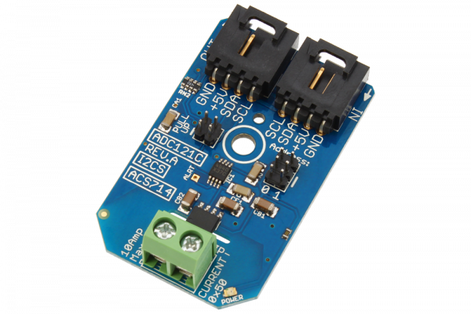

[](https://store.ncd.io/product/1-channel-dc-current-monitor-i2c-mini-module/).

# ADC121C_ACS714

The ACS714-5 is a very popular Hall Effect current sensor from Allegro MicroSystems with 5-Amps current monitoring capability and high-speed 5 μS response time.  Married to the ADC121C021 (Texas Instruments), one of our favorite analog-to-digital Converters, this mini module can be used for monitoring DC current at up to 188.9k Samples per Second with 12-bit resolution. 
This Device is available from www.ncd.io

[SKU: ADC121C_ACS714]

(https://store.ncd.io/product/1-channel-dc-current-monitor-i2c-mini-module/)
This Sample code can be used with Raspberry Pi.

Hardware needed to interface ADC121C_ACS714 Dc current monitoring With Raspberry Pi :

1. <a href="https://store.ncd.io/product/1-channel-dc-current-monitor-i2c-mini-module/">ADC121C_ACS714 1-Channel Dc current Monitoring Sensor</a>

2. <a href="https://store.ncd.io/product/i2c-shield-for-raspberry-pi-3-pi2-with-outward-facing-i2c-port-terminates-over-hdmi-port/">Raspberry Pi I2C Shield</a>

3. <a href="https://store.ncd.io/product/i%C2%B2c-cable/">I2C Cable</a>

## Python

Download and install smbus library on Raspberry pi. Steps to install smbus are provided at:

https://pypi.python.org/pypi/smbus-cffi/0.5.1

Download (or git pull) the code in pi. Run the program.

```cpp
$> python ADC121C_ACS714.py
```
The lib is a sample library, you will need to calibrate the sensor according to your application requirement.
